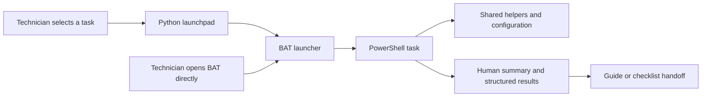
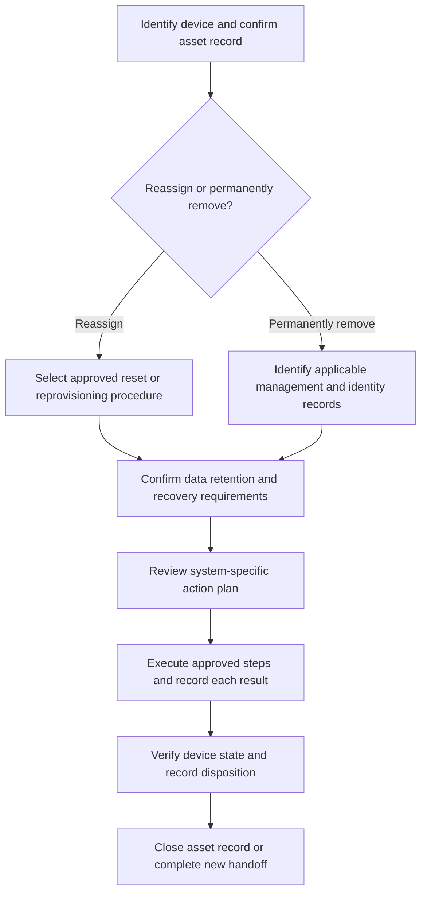

# Repository Foundation and Hierarchy

**Status:** Proposed architecture, version 0.1  
**Date:** September 26, 2026  
**Repository:** `davidtomofficial/Windows-System-Administration`  
**Local staging:** `C:\Users\DavidTom\OneDrive - David Tom Solutions\Me\GitHub\Windows-System-Administration`

## 1. Organizing principle

Organize the repository around the device lifecycle, while giving technicians and developers different entry points into the same tools.

- **Technicians choose a job:** prepare a device, validate it, maintain it, connect it to management, troubleshoot it, or retire it.
- **Developers maintain components:** task definitions, BAT launchers, PowerShell scripts, shared helpers, configuration, and tests.
- **Baselines describe the target state.** Software catalogs describe the applications. Checklists capture the human steps and handoff evidence.

One implementation should serve the GUI, a directly launched BAT file, and an administrator's documented command-line use. Avoid separate copies of the same script for each interface or department.

## 2. Proposed destination tree

This is the **target hierarchy**, not an inventory of implemented files. The current staging pass creates documentation only. Executable names, JSON catalogs, numbered guides, and test files below are planned. Empty folders do not need to be added until their first maintained file exists.

```text
Windows-System-Administration/
├── README.md
├── CHANGELOG.md
├── .gitignore
│
├── Guides/                              # Technician procedures, organized by job
│   ├── README.md
│   ├── 00-Environment-Setup.md
│   ├── 01-Prepare-and-Select-Management.md
│   ├── 02-Apply-Office-Baseline.md
│   ├── 03-Validate-and-Handoff.md
│   ├── 04-Updates-and-Maintenance.md
│   ├── 05-Troubleshooting.md
│   ├── 06-Windows-Upgrade-and-Migration.md
│   └── 07-Device-Return-and-Removal.md
│
├── Checklists/                          # Human workflow and evidence templates
│   ├── README.md
│   ├── Device-Preparation.md
│   ├── Device-Assignment-and-Handoff.md
│   ├── Recurring-Maintenance.md
│   ├── Device-Return-and-Reassignment.md
│   └── Device-Decommissioning.md
│
├── Baselines/                           # Desired state and applicable profiles
│   ├── README.md
│   ├── Workstation/
│   │   └── Windows11-25H2.md
│   ├── Departments/
│   │   ├── Finance.md
│   │   ├── Legal.md
│   │   ├── Healthcare.md
│   │   └── Public-Safety.md
│   └── Profiles/                        # Proposed machine-readable selections
│       ├── office.example.json
│       └── department.example.json
│
├── Apps-Programs/                       # Software catalog and acquisition
│   ├── README.md
│   ├── workstation-environment.md      # Current baseline; later becomes a link
│   ├── baseline-apps.json              # Future catalog of package definitions
│   ├── Config/                         # App-specific deployment templates
│   ├── Acquisition/                    # Official-source download helpers
│   └── Packages/
│       └── README.md                   # Payloads stay outside public Git
│
├── Launchpad/                          # Technician interface; no device logic
│   ├── README.md
│   ├── app.py
│   ├── actions.json                    # Fixed task-to-launcher mapping
│   └── Launchers/
│       ├── Validate-Workstation.bat
│       ├── Maintain-Workstation.bat
│       ├── Upgrade-Windows.bat
│       ├── Export-AutopilotHash.bat
│       ├── Sync-IntuneDevice.bat
│       └── Restart-ComputerGroup.bat
│
├── Scripts/                            # Canonical PowerShell implementation
│   ├── README.md
│   ├── Common/
│   │   └── Common.psm1                 # Logging, checks, results, config loading
│   ├── Deployment/
│   │   ├── Test-Windows11Readiness.ps1
│   │   ├── Start-WindowsUpgrade.ps1
│   │   └── Install-BaselineApplications.ps1
│   ├── Validation/
│   │   ├── Test-Workstation.ps1
│   │   └── Export-HandoffReport.ps1
│   ├── Maintenance/
│   │   ├── Invoke-WorkstationMaintenance.ps1
│   │   ├── Update-Windows.ps1
│   │   ├── Update-DeviceDrivers.ps1
│   │   ├── Update-Applications.ps1
│   │   ├── Repair-WindowsHealth.ps1
│   │   └── Get-MaintenanceReport.ps1
│   ├── Configuration/
│   │   ├── Rename-Workstation.ps1
│   │   ├── Add-ApprovedPrinter.ps1
│   │   └── Get-LocalGroupMembership.ps1
│   ├── Management/                     # Optional service integrations
│   │   ├── Autopilot/
│   │   │   ├── Export-AutopilotHardwareHash.ps1
│   │   │   └── Register-AutopilotDevice.ps1
│   │   ├── Intune/
│   │   │   ├── Get-IntuneDeviceStatus.ps1
│   │   │   └── Sync-ManagedDevice.ps1
│   │   └── Identity/
│   │       ├── Join-ADDomain.ps1
│   │       ├── Get-ADGroupMembership.ps1
│   │       └── Get-EntraGroupMembership.ps1
│   ├── Remote-Actions/
│   │   ├── Restart-ComputerGroup.ps1
│   │   ├── Stop-ComputerGroup.ps1
│   │   └── Invoke-ApprovedRemoteTask.ps1
│   ├── Troubleshooting/               # Reviewed network and support utilities
│   └── Decommissioning/
│       ├── Get-DeviceRemovalPlan.ps1
│       └── Invoke-DeviceRemoval.ps1
│
├── Config/                             # Shared environment examples; no secrets
│   ├── README.md
│   ├── environment.example.json
│   ├── naming.example.json
│   ├── printers.example.json
│   └── computer-groups.example.json
│
├── System-Hardening/                   # Security intent and reviewed policies
│   ├── README.md
│   ├── Policies/
│   └── Exceptions/
│
├── Docs/                               # Maintainer architecture and references
│   ├── Repository-Blueprint.md
│   ├── Migration-Map.md
│   ├── Developer-Guide.md
│   └── Device-Removal-Design.md
│
└── Tests/                              # Future unit and controlled lab validation
    ├── PowerShell/
    ├── Launchpad/
    └── Fixtures/                       # Synthetic data only
```

**Baseline transition:** The existing `Apps-Programs/workstation-environment.md` remains the authoritative draft during this planning pass. When the structure is adopted, move the full text to `Baselines/Workstation/Windows11-25H2.md` and replace the old file with a short navigation link. Keep one maintained copy.

## 3. Folder ownership and boundaries

| Location | Owns | Example |
| --- | --- | --- |
| `Guides/` | Steps a technician follows, prerequisites, expected result, escalation path | Prepare a standalone device or follow an enrollment procedure. |
| `Checklists/` | Human confirmations, asset assignment, exceptions, and sign-off | Confirm peripherals and user acceptance at handoff. |
| `Baselines/` | What a workstation or department profile should contain | Office baseline plus a finance extension. |
| `Apps-Programs/` | How approved applications are obtained, detected, installed, and updated | Application ID, source, licensing, channel, detection rule. |
| `Launchpad/` | Friendly task selection, task metadata, process launching, status | A button labeled “Export Autopilot hardware hash.” |
| `Scripts/` | The reusable inspection or change operation | Export a hash or request a specific management sync. |
| `Config/` | Environment-specific values and targets | Naming formats, approved printers, output locations. |
| `System-Hardening/` | Security policy intent, settings, and approved exceptions | Firewall policy requirements and validation notes. |
| `Docs/` and `Tests/` | Developer contracts, migration decisions, and evidence of behavior | Script contract and tests using synthetic device records. |

App deployment templates belong in `Apps-Programs/Config/`; shared organizational values belong in root `Config/`. Baseline profiles select application IDs from the catalog rather than duplicating installer details. Scripts that apply hardening still belong in `Scripts/` and reference the policy source.

## 4. Technician-facing hierarchy

Use a small set of plain-language launchpad categories. A technician should not need to understand the source tree to locate a task.

| Category | Example buttons or jobs | Intended behavior |
| --- | --- | --- |
| Prepare a device | Check Windows 11 readiness; install office applications; rename device; add printer | Inspect prerequisites, show changes, run the selected provisioning task. |
| Validate and hand off | Validate workstation; export handoff report | Report against the selected baseline without silently changing settings. |
| Update and maintain | Update workstation; repair Windows health | Explicitly select servicing or repair work and report restart requirements. |
| Connect to management | Export hardware hash; register Autopilot device; request Intune sync | Show only applicable integrations and explain missing prerequisites. |
| Troubleshoot and support | Reviewed network tools; local group information; support diagnostics | Show a clear task scope and readable result. |
| Manage a computer group | Restart selected computers; shut down selected computers | Preview the resolved target list and report each target separately. |
| Return or remove a device | Create removal plan; open removal procedure | Follow the approved reassignment or disposal workflow. |

The field workflow is **identify device → select task/profile → review requirements and changes → run → review results → attach evidence to the assignment or ticket**. Every task should say whether it checks, changes, contacts a service, or restarts a device.

## 5. Interface and script execution



Python owns the interface; BAT files start known tasks; PowerShell owns the operation. Direct BAT use must provide the same prerequisites and confirmations as GUI use. Python may be unavailable on a fresh Windows installation, so decide later whether to supply a supported runtime or a packaged executable. The BAT path remains usable independently.

The GUI should open normally and request elevation only for tasks that need it. Define fixed task mappings, input validation, process exit handling, and clear completion states. Do not add arbitrary command execution to the field interface. See the [launchpad design](../Launchpad/README.md) and [script conventions](../Scripts/README.md).

## 6. Standalone and managed deployment

**Standalone provisioning is a first-class workflow:** inspect supported hardware, install or upgrade Windows through the appropriate path, apply the approved baseline, install applications, validate, and hand off. Intune and Autopilot must not be prerequisites for local tasks. Internet access, licenses, or application sign-in may still be required.

Optional workflows add the approved identity and management model: Active Directory, Microsoft Entra ID, Intune, or an approved hybrid arrangement. Record the chosen model explicitly; do not automatically domain-join or enroll a device as a side effect of routine maintenance. Domain membership, local groups, AD groups, Entra groups, and Intune assignment filters are distinct concepts and need accurately named checks.

## 7. Initial project outlines

### Windows upgrade and migration

Begin with eligibility and source-OS detection. A supported Windows 10-to-11 upgrade and a Windows 7/8/8.1 migration are separate procedures. For the older systems, plan backup, supported hardware, licensing, clean installation or reimaging, and restoration instead of promising one universal in-place upgrade button. Microsoft documents the [supported upgrade paths](https://learn.microsoft.com/en-us/windows/deployment/upgrade/windows-upgrade-paths) and the [Windows 7 clean-install requirement for moving directly to Windows 11](https://www.microsoft.com/en-us/licensing/product-licensing/windows).

The workflow should record compatibility results, recovery readiness, required restarts, and post-upgrade validation. Requirement-bypass scripts in the inventory need a separate review decision and are not part of the proposed supported baseline.

### Image Validator and workstation maintenance

Retain **Image Validator / Maintenance** as the project concept, implemented through two explicit operations:

1. `Test-Workstation.ps1` checks the running workstation and reports missing requirements.
2. `Invoke-WorkstationMaintenance.ps1` coordinates selected updates or repairs, then runs validation again.

Initial maintenance scope: approved Windows updates, OEM-approved drivers/firmware, and supported application updates through their designated update owners, including WinGet where appropriate. WinGet does not supply Windows servicing or every application's updater; its [upgrade command](https://learn.microsoft.com/en-us/windows/package-manager/winget/upgrade) works on recognized packages with available updates. Preserve managed channels and package exclusions and report unsupported or failed updates.

Later additions may include DISM/SFC health checks and repair, missing-application installation, and an explicitly selected Intune sync. AD joining and enrollment remain provisioning actions. A weekly maintenance profile is a future option, with defined scope, scheduling, restart windows, and results; no recurring task is being created now.

In this project, “image validation” initially means validating an installed, running workstation. Offline WIM/image servicing would be a separate future feature.

### Intune and Autopilot

Use distinct tasks for **collect → review/export → register → verify profile → provision/enroll → verify management**. Writing a file to `C:\Intune` is a local export, not a cloud upload.

Proposed local evidence layout:

```text
C:\Intune\<serial-number>\<timestamp>\
├── Autopilot-Import.csv       # Only fields accepted by Microsoft's import format
├── Device-Summary.json       # Extra local inventory and collection metadata
└── Collection.log           # Collection result and errors
```

The import CSV should follow Microsoft's [hardware-hash collection and CSV requirements](https://learn.microsoft.com/en-us/autopilot/add-devices). Keep extended inventory in the separate summary file. Preserve a local copy for manual review; any copy to an approved share or upload to the tenant is a separately configured action with a recorded outcome. Restrict access and define retention for these device records.

Hash collection, [Autopilot registration](https://learn.microsoft.com/en-us/autopilot/registration-overview), profile assignment, and Intune enrollment have different outcomes. A successful export must never be shown as successful enrollment. Rename, printer configuration, group detection, and work/school management sync each need their own scope and prerequisites.

### Device removal and reassignment

Start with a design document and a plan-only inventory of applicable management records. Distinguish reassignment within the organization, management retirement, record cleanup, data erasure, and permanent disposal. These are different actions.



This is a project flow, not an execution order for deleting cloud records. Define the correct sequence for the actual join/enrollment model using current vendor guidance, including [Autopilot deregistration](https://learn.microsoft.com/en-us/autopilot/registration-overview) and [Intune device deletion](https://learn.microsoft.com/en-us/intune/device-management/actions/delete). Do not equate deleting a record with erasing the endpoint, or assume every system was updated when one operation succeeded.

### Useful scripts and computer groups

Review the existing collections before importing them. Standardize a target-definition format that can represent an explicit list or a naming range such as `LAB-01` through `LAB-20`. Resolve the range to a concrete list and preview it before a reboot or shutdown. Record unreachable devices, failures, and completion per target; make local-device and remote-group actions visibly different.

Keep profile cleanup, disk cleanup, network repair, remote sessions, package installation, and signing tools in named categories after their contents have been reviewed. See the [migration map](Migration-Map.md).

## 8. Evidence, configuration, and source control

Source control contains scripts, sanitized examples, baseline definitions, checklist templates, and documentation. Device exports, completed user-assignment forms, credentials, real target lists, logs, installer payloads, and captured images belong in approved storage outside the public repository.

Proposed runtime defaults are `%ProgramData%\WindowsSysAdmin\Logs` and `%ProgramData%\WindowsSysAdmin\Reports`, with `C:\Intune` reserved for the requested Autopilot export workflow. Choose appropriate access permissions during implementation. Use a per-user output location for tasks that do not need elevated write access.

Public configuration examples will describe naming, printers, output locations, update ownership, and optional integrations. Private environment configuration supplies actual values at runtime. Never embed tenant credentials or domain passwords in the Python interface, BAT launchers, or scripts.

## 9. Implementation sequence

| Phase | Deliverable | Completion evidence |
| --- | --- | --- |
| 1 — Foundation | Review this hierarchy and map existing tools and checklists. | Agreed locations, identified owners, and import inventory. |
| 2 — Canonical scripts | Review existing implementations; extract common logging, configuration, and result handling. | Documented behavior and testing on representative lab devices. |
| 3 — First technician tasks | Validation, local hardware-hash export, and one controlled maintenance workflow with BAT entry points. | Same task works from the launcher and documented command line. |
| 4 — Minimal launchpad | Add Python buttons for reviewed tasks and present clear results. | Technician can complete an assigned task without editing code. |
| 5 — Management integrations | Add registration, sync, identity checks, approved rename/printer workflows. | Verified local and service outcomes, with required permissions documented. |
| 6 — Advanced lifecycle | Add removal workflows, group actions, and an optional scheduled maintenance profile. | Tested scope, recovery behavior, per-device results, and approved operating procedures. |

Use task status labels **Planned → Under review → Lab validated → Released**, with **Deprecated** for replaced tasks. A file's presence in the repository does not make it a supported launchpad action. Release only the scripts and guides verified together; use the repository history and release tags instead of proliferating `final`, `new`, `v2`, or `copy` files.
